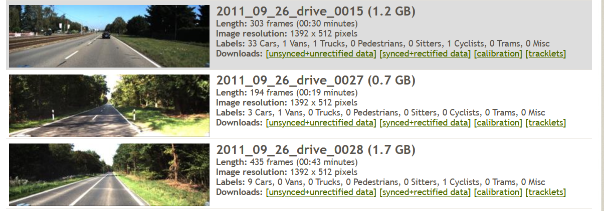
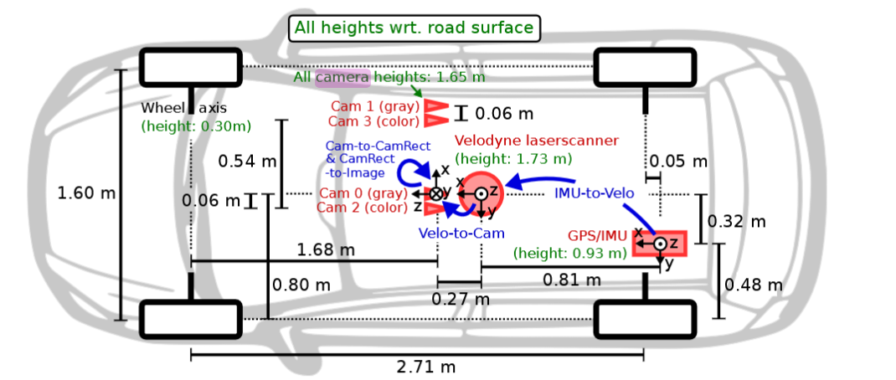
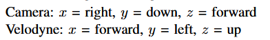
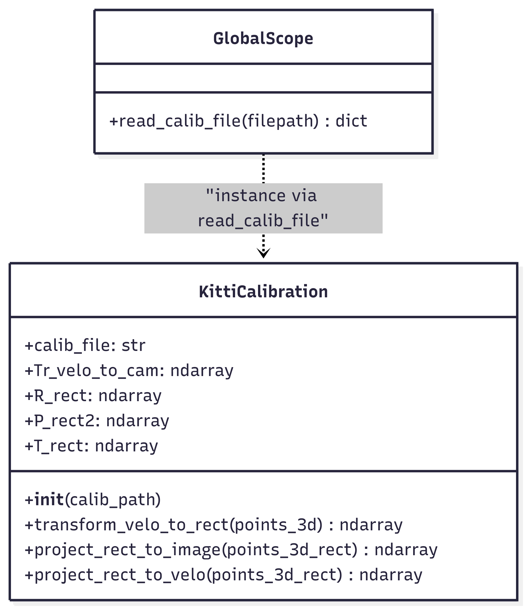
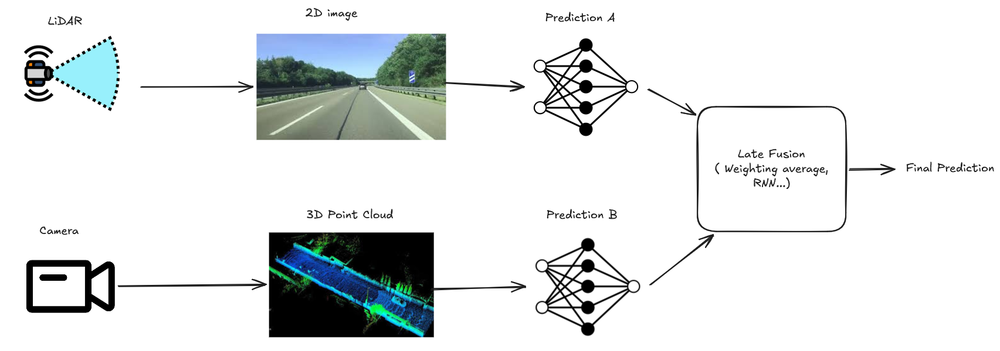
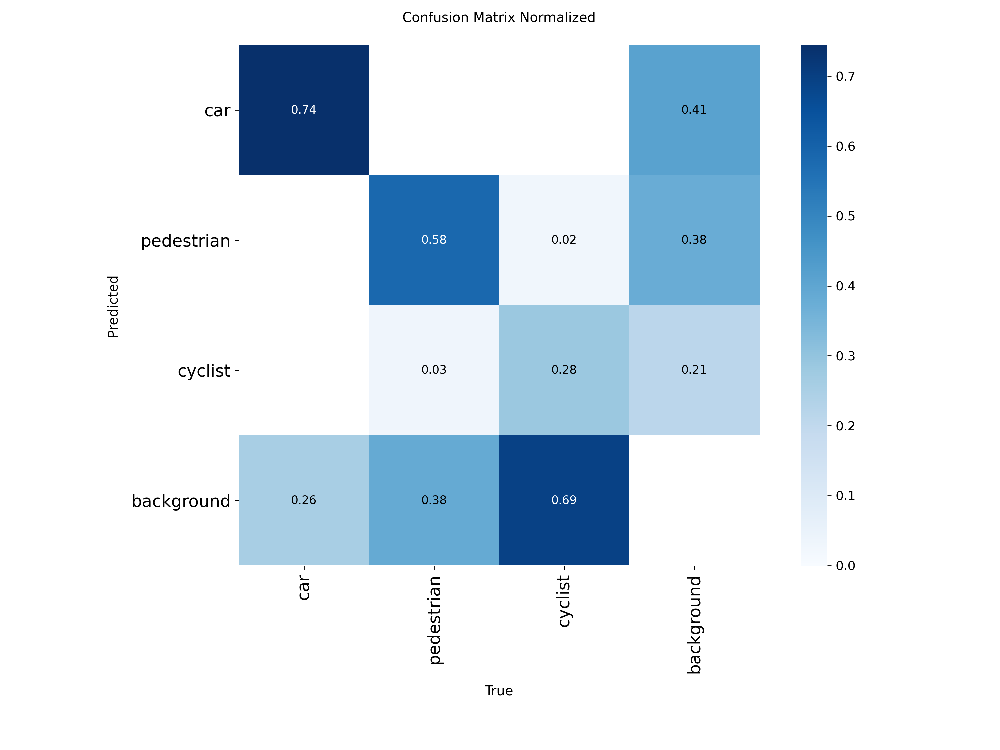
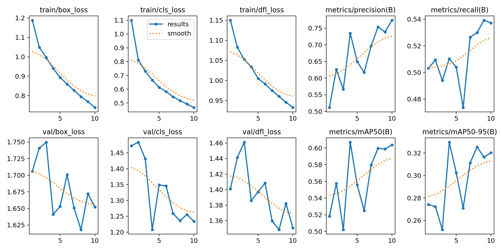
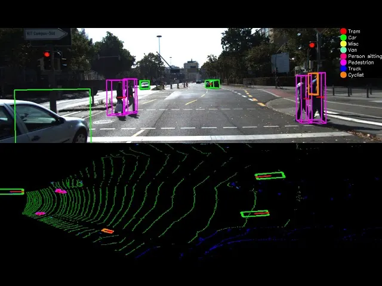
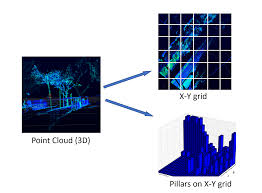
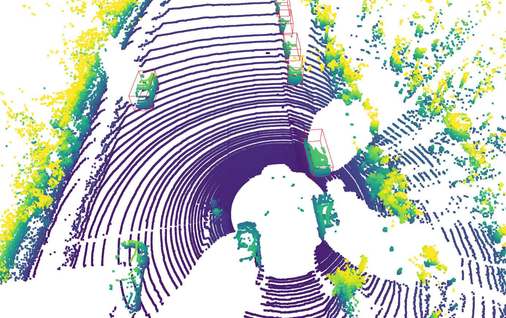

# Multimodal detection CNN and LiDAR

The goal is to implement a multimodal approach for detection combining LiDAR and computer vision.

## What is LiDAR?
LiDAR is for ***Light Detection And Ranging*** it works like a sonar with light. It generates a 3D Scatter plot where each point has an intensity/reflectance.

- pros:
    - works in dark conditions
    - can measure distances
- cons:
    - doesnt react well with water and fog
    - if objects are far away they can be avoided by the light rays and not detected

# Table of contents
- [1 Getting Started](#1-getting-started)
- [2 Data Handling and calibration](#2-dataset-handling-and-calibration)
- [3 Late fusion approach](#3-late-fusion-approach)
- [4 Middle fusion approach](#4-middle-fusion-approach)
- [5 Sources](#5-sources)
- [6 Future and improvments](#6-future-and-improvments)
- [7 Glossary](#7-glossary)


# 1 Getting started
(to do at the end of the project)
To use this repo you need:

...

# 2 Data Handling and calibration
The dataset is composed of a tracking sub dataset, a velodyne dataset and videos to test the results.
<!-- I did select 3 videos:
 -->
Velodyn (named velo sometimes) refers to the LiDAR. I will use frames from camera 2 as it's the colored version.


## 2.1 Coordinate system
From the paper we know:


and labels are:

61 3 Car 1 0 -2.101562 858.090004 200.535261 1241.000000 374.000000 1.377451 1.491847 3.318948 3.256830 1.648443 5.626493 -1.600523

for

Frame_ID Track_ID Type Truncated Occluded Alpha bbox_left bbox_top bbox_right bbox_bottom Height Width Length Location_X Location_Y Location_Z Rotation_y


The dataset is big i want first to do only the computer vision then to do the LiDAR part alone too. Then i can do both together. To do that and avoid data leakage i will create 2 subdatasets (kitti_lidar & kitti_yolo) but both will be splitted the same:

| split | sequence |
|-------|-------|
| train | 0-14  |
| val   | 14-18 |
| test  | 18-20 |

Also i will simplify the task by changing classes to:
 {"Car": 0, "Van": 0, "Truck": 0, "Pedestrian": 1, "Person_sitting": 1, "Cyclist": 2}

## 2.2 Projection & Translation

The LiDAR sensor and Camera 2 don't have the same position. The Kittit Dataset contain the data to project the LiDAR results on the camera referential.
We  can summarize:
$P_{2d} = P_{rect} \times R_{rect} \times Tr_{velo-to-cam}\times P_{3d}$
where:
- $P_{3d}$ is the LiDAR measurement in it's referential
- $Tr_{velo-to-cam}$ Is the translation to move $P_{3d}$ to the camera referential
- $R_{rect}$ To align the two referentiels on the same axle
- $P_{rect}$ To Transform the 3D to 2D using the physicals of the camera (focal, lens)
- $P_{2d}$ Is the projected results of the LiDAR on the 2d images

We have :
- calib_velo_to_cam: With the ***Tr_velo_to_cam***
- calib_cam_to_cam: With ***Rrect*** and ***Prect***

***[cordonnées homogenes/ Homogeneous coordinates](https://fr.wikipedia.org/wiki/Coordonn%C3%A9es_homog%C3%A8nes)***

In the calibration file, there are times where matrix has a 1 line added. its for doing the translation. The explanation are in the link.

Then we filter the data to keep only what's in front of the LiDAR sensor.

***Attention:  dans raw c est selon lidar et dans synced selon camera***
### Calibration class

This class purpose is to do the calibration.


*note : The method rect_to_velo should be renamed ***transform_rect_to_velo***

## 2.3 Cloud Points Display

# 3 Late fusion approach
Late fusion is when each modality create a prediction of features or decision and those are grouped and use to make a final decision.




## 3.1 CNN
### 3.1.1 First Training
I use Yolo with ultralytics as the experiments are easy to trace with the library and give all the plots directly.




TO DO improve the model...

## 3.2 LiDAR

### 3.2.1 BEV and Point Pillars
First we create a dataset to split the data.
I want to use ***BEV (Bird Eye View)***:
BEV consist in converting the 3D points in a 2D representation seen from the sky. 


More precisely i will use ***Point Pillar***:
Point Pillar is a process to encode the 3D point cloud image to a 2D BEV image. The space is divided in pillars with different features encoded. The 2D image created is called the pseudo-image.

Formy pillar i used the height and density.


*image from [medium](https://becominghuman.ai/pointpillars-3d-point-clouds-bounding-box-detection-and-tracking-pointnet-pointnet-lasernet-67e26116de5a)*

But has seen before labels are on image_02 referential and LiDAR point clouds are on Velodyne sensor referential.
Labels are easier to translate.
So i need to take the labels coordinates and translate them to the lidar Reference.
### 3.2.2 Pillar Dataset class
The goal is to have get the point clouds and labels on the same referential. The velodyne one here as moving labels will cost less computation.
There are 3 important methods:

- load_label() &rarr;
- transform_to_pillar &rarr;
- get_item() &rarr;

### 3.2.3 Model & Loss - Iteration 1
Then my first model pillarbackbone was like this:
This backbone takes the pseudo-image as input and outputs a feature map that can be used for detection.
        in_channels: Number of channels in the input pseudo-image (e.g., 2 for height and density)  
        out_channels: Number of channels in the output feature map (e.g., 7 for (x,y,z,l,w,h,yaw) per cell)"""

But the problem is i predict a box for each pillar. So in the end i get a number of predictions equal to the number of pillar.

### 3.2.4 Model & Loss - Iteration 2
In pillarbackbone2 i solved this problem adding a output feature.
There are 2 [heads](#1-heads). 

- classification head: Predict the probability of a presence of an object for each pillar
- Regression head: Predict Bounding Box parameters (x,y,z,l,w,h,theta) --> I switch to vectors from the center because it was to hard for the model

Why only one [backbone](#2-backbone) and 2 heads? 

&uarr; I work on my personnal computer limited on computation ressources. 
1. Feature sharing: Using a single model reduce by 2 the number of convolution i will need. Backbone will extract the features needed fr both tasks.
2. Backbone learn features that will help fir both tasks
3. Easy to implement : Only one model to train

As there are two heads i need to adapt my loss function:
- classification head (BCEWithLogitsLoss): Calculated on entire grid: Penalize if the model miss an object or predict a box where there should not be a box
- Regression head (SmoothL1Loss): Calculated on masked pillars (where an object actually exist): Its like that so the model doesnt learn on empty space.

### 3.25 Model & Loss - Iteration 3

```bash
Step 140 | Pred Mean (dx,dy): -0.0015 | Target Mean (dx,dy): -0.0001
Stats cibles: Min=-4.18, Max=1.19
Step 160 | Pred Mean (dx,dy): -0.0004 | Target Mean (dx,dy): 0.0014
Stats cibles: Min=-4.64, Max=1.57
Step 180 | Pred Mean (dx,dy): 0.0029 | Target Mean (dx,dy): -0.0000
Stats cibles: Min=-4.70, Max=1.57
Step 200 | Pred Mean (dx,dy): -0.0004 | Target Mean (dx,dy): -0.0002
Stats cibles: Min=-4.69, Max=1.57
Step 220 | Pred Mean (dx,dy): 0.0005 | Target Mean (dx,dy): 0.0002
Stats cibles: Min=-4.70, Max=1.56
Step 240 | Pred Mean (dx,dy): 0.0009 | Target Mean (dx,dy): 0.0001
Stats cibles: Min=-4.71, Max=1.40
Step 260 | Pred Mean (dx,dy): -0.0037 | Target Mean (dx,dy): -0.0007
Stats cibles: Min=-4.60, Max=1.57
Step 280 | Pred Mean (dx,dy): -0.0018 | Target Mean (dx,dy): 0.0002
Stats cibles: Min=-4.59, Max=1.52
Step 300 | Pred Mean (dx,dy): 0.0020 | Target Mean (dx,dy): 0.0005
Epoch 2/5 - Loss: 0.2825

[DEBUG VAL] Stats CLS (Logits): Min=-10.11, Max=-3.31, Mean=-3.69
[DEBUG VAL] Stats REG (Preds): Min=-0.87, Max=0.90, Mean=0.01
[DEBUG VAL] Proportion pixels prédits comme objets: 0.0000
Epoch 2/5 - Val Loss: 0.2816
debug metrics types: train_loss=<class 'float'>, val_loss=<class 'float'>
Stats cibles: Min=-4.70, Max=1.57
Step 0 | Pred Mean (dx,dy): -0.0002 | Target Mean (dx,dy): -0.0000
Stats cibles: Min=-4.27, Max=1.40
Step 20 | Pred Mean (dx,dy): 0.0016 | Target Mean (dx,dy): -0.0005
Stats cibles: Min=-4.38, Max=1.51
Step 40 | Pred Mean (dx,dy): -0.0004 | Target Mean (dx,dy): 0.0016
Stats cibles: Min=-4.70, Max=1.56
Step 60 | Pred Mean (dx,dy): -0.0021 | Target Mean (dx,dy): -0.0004
```

The issue was

So i directly switch to an anchor based model.

Then i realized right and left were reversed thanks to the small apendice in front of the LiDAR and the car in diagonal

## 3.3 Fusion


# 4 Middle fusion approach


# 5 Sources
- [KITTI Coordinate Transformations](https://medium.com/data-science/kitti-coordinate-transformations-125094cd42fb)
- [Vision meets Robotics: The KITTI Dataset](https://www.cvlibs.net/publications/Geiger2013IJRR.pdf)
- [Camera-Lidar Projection: Navigating between 2D and 3D](https://medium.com/swlh/camera-lidar-projection-navigating-between-2d-and-3d-911c78167a94)
- [open library for LiDAR detection](https://github.com/open-mmlab/OpenPCDet?tab=readme-ov-file)
- [Bird Eye View](https://medium.com/@nikitamalviya/birds-eye-view-a-new-perspective-20323ee06fdf)
- [ late fusion medium](https://medium.com/@raj.pulapakura/multimodal-models-and-fusion-a-complete-guide-225ca91f6861#ea9c)
- [anchors?](https://arxiv.org/pdf/2211.06108)
- [Point Pillar](https://arxiv.org/pdf/1812.05784)
- [matching by IOU](https://pyimagesearch.com/2016/11/07/intersection-over-union-iou-for-object-detection/)
- >@article{Zhou2018,
   author  = {Qian-Yi Zhou and Jaesik Park and Vladlen Koltun},
   title   = {{Open3D}: {A} Modern Library for {3D} Data Processing},
   journal = {arXiv:1801.09847},
   year    = {2018},
}
>


## 5.1 Data Sources

# 6 Future and improvments

# 7 Glossary
##### 1 Heads
Final part of the network that convert features to a prediction
##### 2 Backbone
It's the part of the model that takes raw data and converts it to features